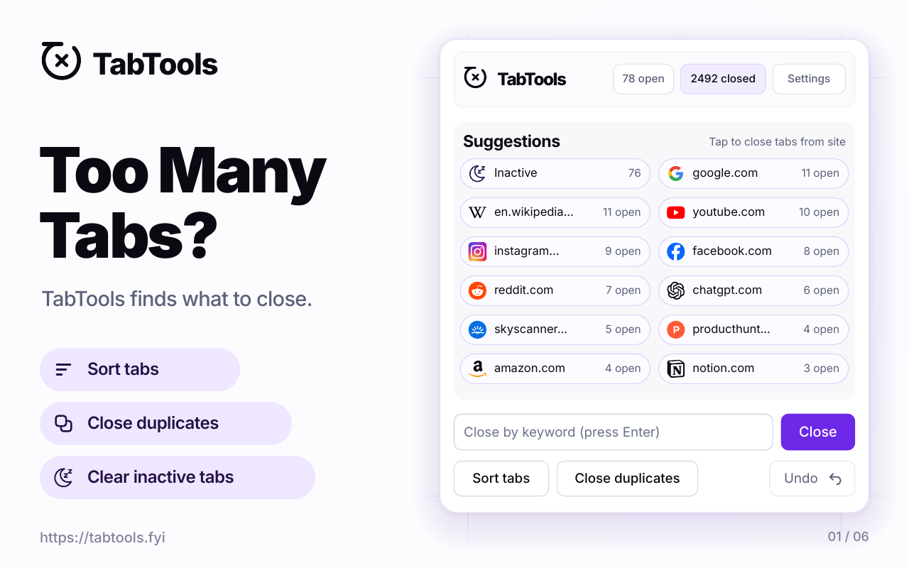
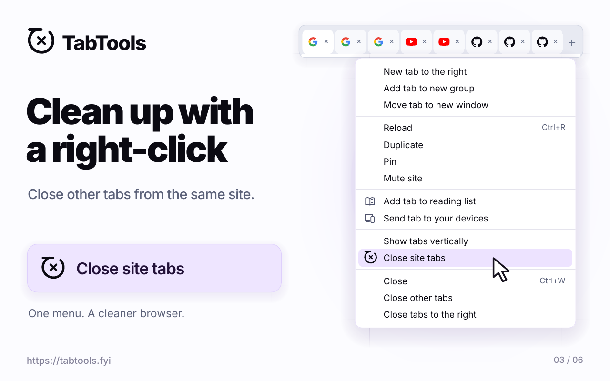
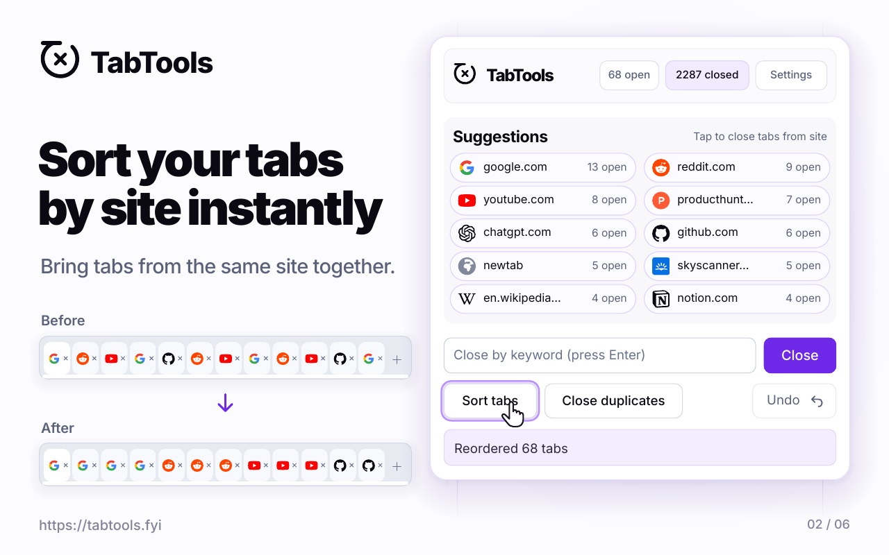

<h1> TabTools</h1>

Clear your tab list quickly with site suggestions, inactive tab cleanup, duplicate removal, and sorting.

[](https://tabtools.fyi/)

[](https://tabtools.fyi/chrome)
[](https://tabtools.fyi/firefox)
[](https://tabtools.fyi/edge)

## Highlights

- Close tabs by keyword or exact domain, with suggestions for busy sites.
- One-click cleanup for inactive tabs, duplicates, and domain-heavy windows.
- Undo the last close, track total tabs closed, and toggle light/dark themes.
- Context menu entry to close tabs for the current site.

## See it in action

### Right-click cleanup

Close tabs from the same website using the **Close site tabs** context menu action.



### Sort tabs by site

Bring tabs from the same website together with **Sort tabs**.



## Usage

- Open the popup, type a keyword or domain, then press Enter or click Close.
- Tap a suggestion chip to close tabs for that site (or inactive tabs).
- Use quick actions to sort tabs, close duplicates, or undo the last close.
- Adjust the minimum tab count for suggestions and the inactive threshold in Settings.

## Build

PowerShell (no Node needed):

```powershell
.\build.ps1             # all browsers
.\build.ps1 firefox     # single target
```

Node 18+ (optional):

```bash
node build.js           # all browsers
node build.js firefox   # single target
```

Outputs land in `dist/<browser>/`.

## Install (temporary/dev)

- **Firefox:** `about:debugging` -> This Firefox -> Load Temporary Add-on -> `dist/firefox/manifest.json`
- **Chrome/Chromium:** `chrome://extensions` -> Developer mode -> Load unpacked -> `dist/chrome/`
- **Edge:** `edge://extensions` -> Developer mode -> Load unpacked -> `dist/edge/`

## Layout

```
src/
  shared/      # common scripts, UI, assets
  overrides/   # browser-specific manifest/files (chrome, edge, firefox)
```

## Contributing

Contributions are welcome. See [CONTRIBUTING.md](CONTRIBUTING.md) for setup,
testing, and pull request guidance.

## License

TabTools is licensed under the [Mozilla Public License 2.0](LICENSE).
