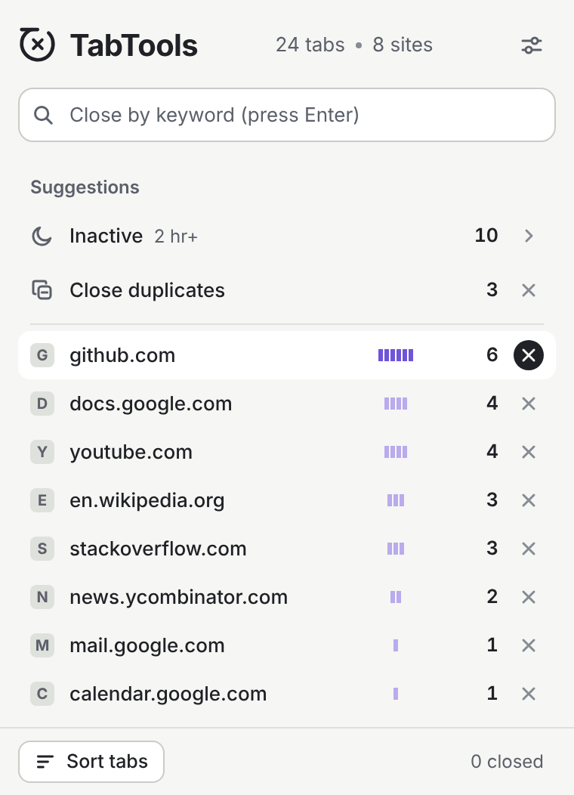
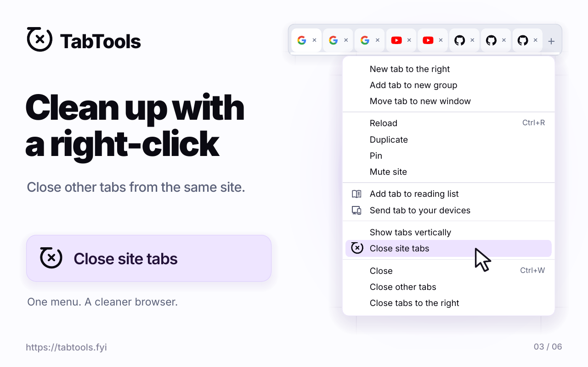

<h1> TabTools</h1>

Close tabs by site, clear duplicates and inactive tabs, and sort what stays.

<a href="https://tabtools.fyi/">
  <picture>
    <source media="(prefers-color-scheme: dark)" srcset="docs/images/tabtools-popup-dark.png">
    
  </picture>
</a>

[](https://chromewebstore.google.com/detail/tabtools/penbnlignepchllgkflhnpfbabdfalkk?utm_source=github&utm_medium=referral&utm_campaign=readme&utm_content=badge_chrome)
[](https://addons.mozilla.org/en-US/firefox/addon/tabtools-michael-wester/?utm_source=github&utm_medium=referral&utm_campaign=readme&utm_content=badge_firefox)
[](https://microsoftedge.microsoft.com/addons/detail/tabtools/hajmbphgjkkinedfebgnpodlknanfdlh?utm_source=github&utm_medium=referral&utm_campaign=readme&utm_content=badge_edge)

You can try the popup on sample tabs at [tabtools.fyi](https://tabtools.fyi/).

## Highlights

- One list of every site with open tabs, the busiest first, with a mark for each tab. Click a site to close its tabs.
- Type a keyword or a site to see the matching tabs before anything closes.
- Review inactive tabs before closing them, close duplicates in one click, and sort a window by site.
- Undo a close for a few seconds, a count of tabs closed, and light, dark and system themes in six accent colours.
- A right-click menu entry that closes the current site's tabs.

## See it in action

### Right-click cleanup

Close tabs from the same website using the **Close site tabs** context menu action.



## Usage

- Open the popup and click a site under **Suggestions** to close its tabs. Pinned tabs stay open unless you turn off **Keep pinned tabs open** in Settings.
- Type a keyword, or a site such as `youtube.com` (its subdomains are included), to list the matching tabs. Press Enter or click **Close** to close the tabs listed, or use the button on a row to close that tab alone.
- Click **Inactive** to review the tabs you have not used for a while, with the time since each was last used. Set how long counts as inactive, from 30 minutes to 1 week, then click **Close**.
- Click **Close duplicates** to close extra copies of a page. Two tabs are copies when their whole addresses match. A pinned copy, a copy playing sound and the copy in view stay open.
- Click **Sort tabs** to bring a window's tabs together by site. Pinned tabs and tab groups stay where they are.
- After a close, **Undo** is offered at the bottom of the popup for a few seconds.
- Settings hold the theme (System, Light or Dark), the accent colour, the inactivity time, **Keep pinned tabs open**, and a reset for the count of tabs closed.

## Build

PowerShell (no Node needed):

```powershell
.\build.ps1             # all browsers
.\build.ps1 firefox     # single target
```

Node 18+ (optional):

```bash
node build.js           # all browsers
node build.js firefox   # single target
```

Outputs land in `dist/<browser>/`.

## Install (temporary/dev)

- **Firefox:** `about:debugging` -> This Firefox -> Load Temporary Add-on -> `dist/firefox/manifest.json`
- **Chrome/Chromium:** `chrome://extensions` -> Developer mode -> Load unpacked -> `dist/chrome/`
- **Edge:** `edge://extensions` -> Developer mode -> Load unpacked -> `dist/edge/`

## Layout

```
src/
  shared/      # common scripts, UI, assets
  overrides/   # browser-specific manifest/files (chrome, edge, firefox)
```

## Contributing

Contributions are welcome. See [CONTRIBUTING.md](CONTRIBUTING.md) for setup,
testing, and pull request guidance.

## License

TabTools is licensed under the [Mozilla Public License 2.0](LICENSE).
